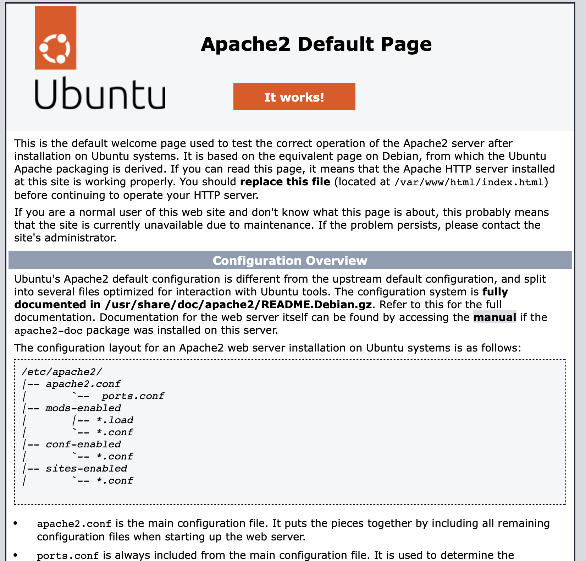
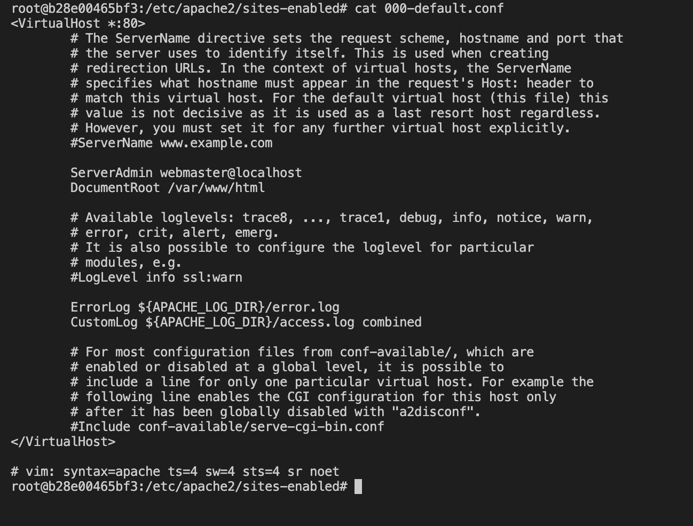
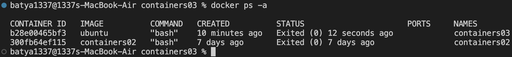
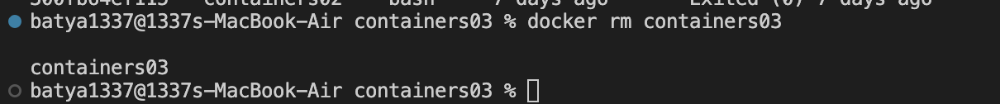

1.IWNO3: Использование контейнеров как среды выполнения

2.Цель работы:

Данная лабораторная работа призвана напомнить основные команды ОС Debian/Ubuntu. Также она позволит познакомиться с Docker и его основными командами.

3.Задание

Запустить контейнер Ubuntu, установить Web-сервер Apache и вывести в браузере страницу с текстом "Hello, World!".

4.Описание выполнения работы с ответами на вопросы.

1)Запустил команду docker run -ti -p 8000:80 --name containers03 ubuntu bash
apt update: Обновляет информацию о доступных пакетах в репозиториях на вашем сервере, позволяя вам установить последние версии программного обеспечения.

apt install apache2 -y: Устанавливает веб-сервер Apache2 на вашем сервере. Флаг -y автоматически подтверждает все предложенные изменения без дополнительного ввода от пользователя.

service apache2 start: Запускает службу (сервис) Apache2, чтобы веб-сервер начал обслуживать запросы и отдавать веб-страницы.

2)
3)ls -l /var/www/html/: Выводит список файлов и директорий в указанной директории (/var/www/html/) с дополнительной информацией, такой как права доступа, владелец, размер и время последнего изменения.

echo "<h1>Hello, World!</h1>" > /var/www/html/index.html: Создает файл с именем index.html в директории /var/www/html/ и записывает в него строку "<h1>Hello, World!</h1>" с помощью команды echo.

4)cd /etc/apache2/sites-enabled/: Перемещает текущую рабочую директорию в /etc/apache2/sites-enabled/, где обычно хранятся конфигурационные файлы для активных веб-сайтов веб-сервера Apache.

cat 000-default.conf: Выводит содержимое файла 000-default.conf в консоль. Этот файл обычно содержит конфигурацию для "дефолтного" виртуального хоста (веб-сайта) на сервере Apache.

5)Команда docker ps -a используется для отображения списка всех контейнеров Docker

6)Команда docker rm containers03 используется для удаления контейнера Docker с именем или идентификатором "containers03".

